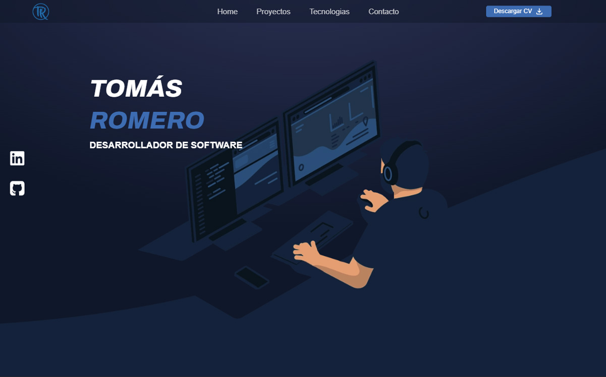
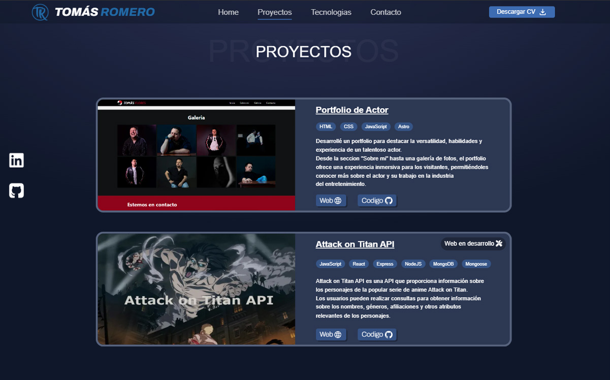
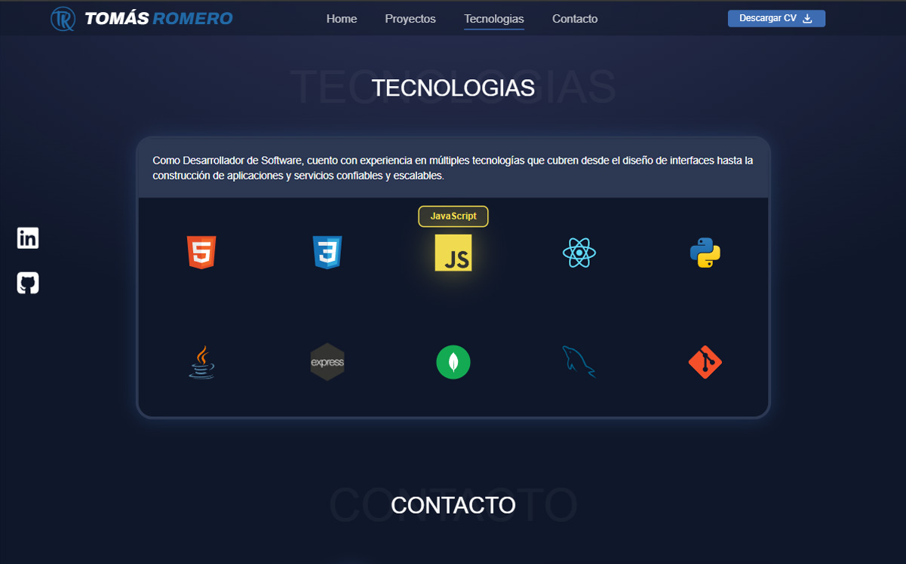
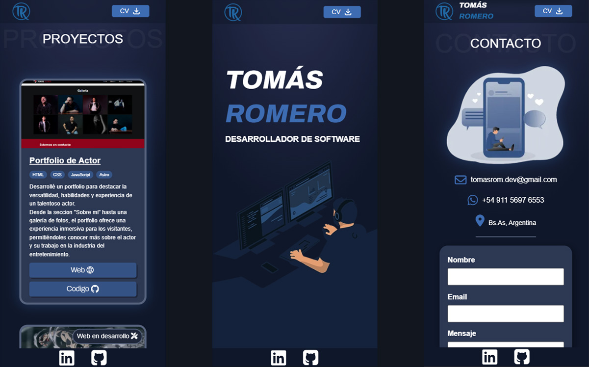

#  Tomás Romero – Portfolio Personal

[](https://romerotomas.com)
[](https://romerotomas.com)

> **Portfolio web personal** desarrollado con Astro para mostrar mi trayectoria profesional, proyectos destacados y stack tecnológico como Software Developer.

## Demo en vivo

Podés explorar el portfolio completo en: **[tomasrome.github.io](https://romerotomas.com)**

---

## 📷 Capturas de pantalla

|       |     |
| --------------------------------------- | ---------------------------------------- |
|  |  |

---

## Características principales

- Sección de **presentación personal** .
- Apartado de **proyectos destacados** con enlaces directos.
- **Tecnologías y habilidades**.
- **Diseño responsive**, adaptado a dispositivos móviles y escritorio.
- Opción de **descargar CV** en PDF.

---

## Tecnologías utilizadas

- 
- 
- 
- 

---

## ⚙️ Instalación y uso

Si querés clonar el proyecto y correrlo en tu entorno local:

```bash
# Clonar el repositorio
git clone https://github.com/tomasrome/tomasrome.github.io.git

# Entrar al directorio
cd tomasrome.github.io

# Instalar dependencias
npm install

# Correr el proyecto en desarrollo
npm run dev
```

La aplicación se abrirá en http://localhost:4321.

---

## Contacto

- **Email:** tomasrom​.dev@gmail.com
- **WhatsApp:** +54 911 5697 6553
- **Buenos Aires, Argentina**

También podes descargar mi CV o visitar mis perfiles profesionales:

- [Descargar CV](https://tomasrome.github.io/CV%20-%20Tom%C3%A1s%20Romero.pdf)
- [LinkedIn](www.linkedin.com/in/tomas-romero-developer)
- [GitHub](https://github.com/tomasrome)

---

<div align="center">

**¡Gracias por visitar mi portfolio!** 🚀

_Desarrollado con ❤️ por [Tomás Romero](https://github.com/tomasrome)_

[](https://github.com/tomasrome/tomasrome.github.io/stargazers)
[](https://github.com/tomasrome/tomasrome.github.io/network)

</div>
